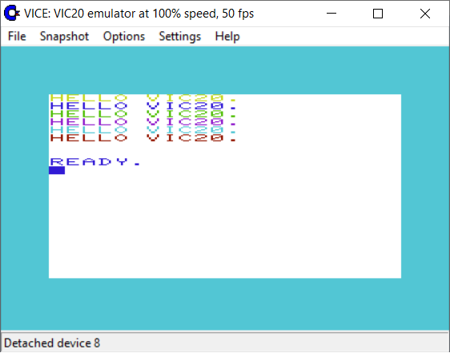

# HELLO VIC 20

Sample assembly program for MOS 6502 (VIC20).

## Build

- `git clone https://github.com/giosil/hellovic20.git`
- `ca65.exe --cpu 6502 -l main.lst main.asm`
- `ld65.exe main.o -o hello.prg -C main.cfg`

## Run on xvic

- Load hello.prg from File->Autostart disk/tape image..

## Contributors

* [Giorgio Silvestris](https://github.com/giosil)
